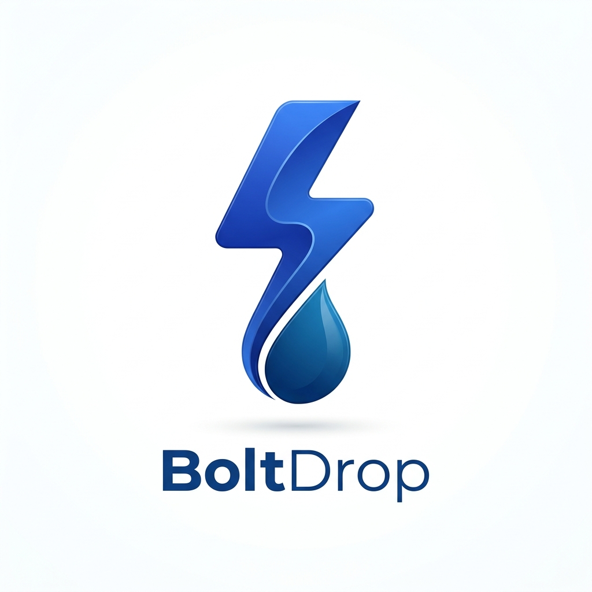

# BoltDrop — Ultra-Fast Secure P2P File Sharing



<p center>
  <a href="https://bolt-share-7q6x.onrender.com/"></a>
  
  
</p>

---

## 📸 Media Gallery

| BoltDrop Brand | FileDrop Interface | BoltShare System |
| :---: | :---: | :---: |
|  |  |  |

---

## 🚀 Overview

**BoltDrop** (hosted at [https://bolt-share-7q6x.onrender.com](https://bolt-share-7q6x.onrender.com)) is a secure, ultra-fast, direct peer-to-peer (P2P) file sharing application built for modern web browsers. BoltDrop uses native WebRTC data channels to securely stream photos, videos, archives, and documents directly between devices without intermediate servers, cloud storage, or file size limits.

---

## ⭐ Key Features

- ⚡ **Direct P2P Streaming:** Files are sent byte-by-byte directly from sender to receiver. No server storage or file size caps.
- 🛡️ **End-to-End Privacy:** Data flows encrypted through WebRTC peer connections.
- 📊 **Real-Time Dual Progress Tracker:** Detailed batch and per-file progress meters with live transfer speeds.
- 🌐 **Dual Mode Connectivity:**
  - **Wi-Fi Local Share:** Auto-discovers devices sharing the same public IP.
  - **Global Internet Mode:** Instant room code generation for remote device connections worldwide.
- 🔄 **Self-Healing Connection:** Automatic ICE restarts, ping/pong keepalives, and automatic reconnection on network drops.

---

## 🛠️ How It Works

1. **Signaling & Discovery:** BoltDrop uses an optimized signaling server to exchange WebRTC offer/answer SDPs.
2. **Direct Peer Connection:** Once signaling completes, a secure RTCPeerConnection and DataChannel are established directly between browsers.
3. **Chunked Streaming:** Files are broken into 64KB chunks and transferred with backpressure management.
4. **Instant Download:** The receiving browser reassembles chunks and automatically triggers a local download.

---

## 💻 Local Development

1. **Install Dependencies:**
   ```bash
   npm install
   ```

2. **Start Dev Server:**
   ```bash
   npm run dev
   ```

3. **Open Application:**
   Visit `http://localhost:3000` in multiple tabs or devices on your network to test P2P file sharing.

---

## 🌐 Live Production Deployment

- **Main Production URL:** [https://bolt-share-7q6x.onrender.com](https://bolt-share-7q6x.onrender.com)
- **Deployment Platform:** Render / Node.js

